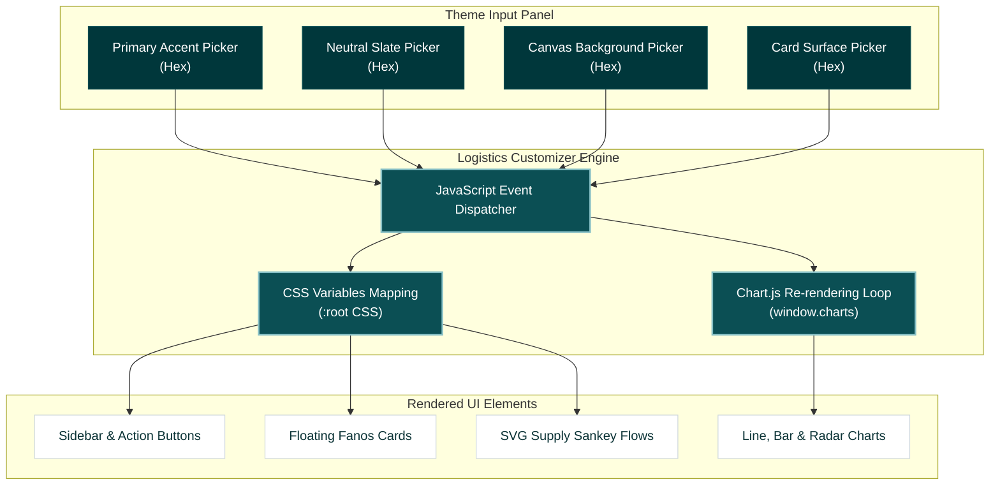

# PharmaVista Executive Command Center Dashboard Specification
### Dynamic Theme Customizer & Design Presets Specification

This document details the architectural layout, typography scale, component blueprints, and the newly integrated **Live Theme Customization Engine** for the **PharmaVista Executive Command Center Dashboard**, adhering to the system rules of [DESIGN (2).md](file:///c:/Users/hamza/Documents/Fanos/DESIGN%20(2).md).

A fully functional, interactive implementation has been compiled and saved directly in your workspace: [PharmaVista_Dashboard.html](file:///c:/Users/hamza/Documents/Fanos/PharmaVista_Dashboard.html).

---

## 1. Brand & Aesthetic Personality

The dashboard combines **Corporate Modernism** with a high-performance analytics interface. It uses deep Eucalyptus teals and Slate grays to establish a professional, forward-thinking clinical atmosphere. 

To reduce visual noise, the layout utilizes **Flat Elevation (Level 0)** for the canvas background, while major data components float on **Level 1 Elevation** containers (white surfaces with subtle borders and soft shadows).

---

## 2. Dynamic Palette Customizer Architecture

To allow operations managers to customize their control room environment, a **Live Palette Customizer** has been integrated into the persistent left sidebar.

### In-Depth Customization Variables
The customizer dynamically maps colors to CSS properties on `:root` and updates them in real-time as users interact with the color wheel:

*   `--color-primary`: Drives active borders, primary buttons, radar area charts, and key chart borders.
*   `--color-primary-dark`: Used for the sidebar background (auto-calculated to be **35% darker** than the primary color to ensure strong contrast).
*   `--color-primary-hover`: Lighter shade used for active selection fills and hover animations.
*   `--color-secondary`: Colors secondary typography columns, grid lines, and subtitles.
*   `--color-background`: Modifies the page canvas background.
*   `--color-surface`: Controls the floating card containers.

---

## 3. High-Contrast Interactive Presets

Users can choose from 5 built-in functional presets using the sidebar selector. The interface and charts update instantly:

1.  **Tech-Forward Eucalyptus (Default):** Calm corporate teals (`#0b4f54`), slate neutral (`#515f74`), and cool light canvas background (`#f6fafc`).
2.  **Royal Navy Clinical:** Deep administrative blue (`#1e3a8a`), classic neutral slate (`#475569`), and off-white background (`#f8fafc`).
3.  **High-Performance Emerald:** High-efficiency logistics green (`#065f46`), dark charcoal secondary (`#334155`), and mint background (`#f0fdf4`).
4.  **Crimson Operation Control:** Urgent monitoring red (`#991b1b`), slate secondary (`#4b5563`), and soft warm background (`#fef2f2`).
5.  **Midnight Dark Mode:** High-vis cyan (`#0d9488`), slate gray (`#94a3b8`), midnight canvas background (`#0f172a`), and charcoal cards (`#1e293b`).

> [!TIP]
> **Adaptive Typography Contrast:** The customizer automatically detects if the selected canvas background is dark. It dynamically flips title text colors (`#ffffff`) and chart axis labels (`#94a3b8`) to guarantee AA compliance under dark mode.

---

## 4. Operational Instructions

1.  Open the workspace folder at `c:\Users\hamza\Documents\Fanos`.
2.  Double-click [PharmaVista_Dashboard.html](file:///c:/Users/hamza/Documents/Fanos/PharmaVista_Dashboard.html).
3.  Scroll down the left sidebar to **Palette Customizer**.
4.  Select a preset (e.g. **Midnight Dark Mode**) or select individual colors to customize the interface. All charts, panels, and sidebars will update in real-time.
